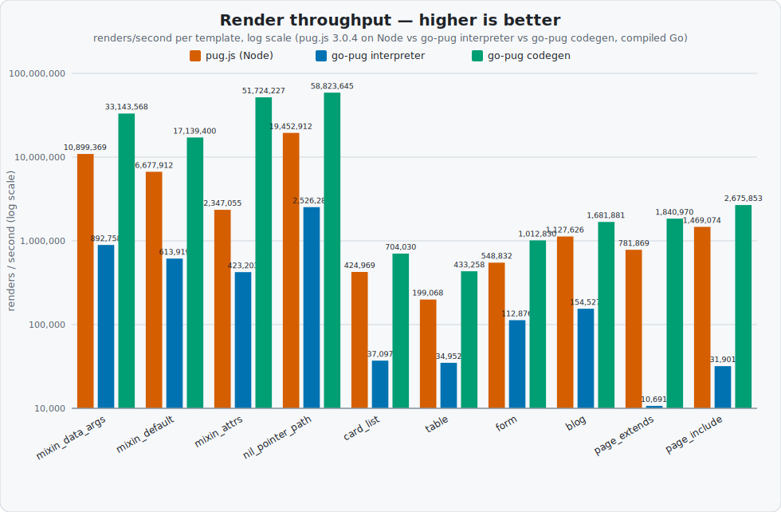

# go-pug render benchmark

A public, reproducible 3-way render-throughput comparison:

- **pug.js 3.0.4** (Node) — the reference implementation
- **go-pug interpreter** — `gopug.Template.Render`, the default runtime path
- **go-pug codegen** — a generated Go render function (`gopug.GenerateGo`), built once and called directly

Metric: **renders/second** (higher is better). Every template in this corpus is verified byte-identical across all three engines before it is timed — see [Byte-identity](#byte-identity).

## Results

Run on the machine recorded in `results.json`'s `machine` field; see that file for exact versions. Values are the median of 5 timed repetitions, each preceded by a discarded warmup (see [Methodology](#methodology)).

Renders/second (higher is better), one column per engine:

| Template | pug.js (Node) | go-pug interpreter | go-pug codegen |
| --- | ---: | ---: | ---: |
| `mixin_data_args` | 10,899,369 | 892,758 | 33,143,568 |
| `mixin_default` | 6,677,912 | 613,919 | 17,139,400 |
| `mixin_attrs` | 2,347,055 | 423,203 | 51,724,227 |
| `nil_pointer_path` | 19,452,912 | 2,526,282 | 58,823,645 |
| `card_list` | 424,969 | 37,097 | 704,030 |
| `table` | 199,068 | 34,952 | 433,258 |
| `form` | 548,832 | 112,876 | 1,012,830 |
| `blog` | 1,127,626 | 154,527 | 1,681,881 |
| `page_extends` | 781,869 | 10,691 | 1,840,970 |
| `page_include` | 1,469,074 | 31,901 | 2,675,853 |

Codegen is the fastest engine on all 10 templates in this corpus, typically 1.5–3x pug.js's throughput; the narrowest margin is `blog` at roughly 1.5x, and the widest is `mixin_attrs` at roughly 22x (an outlier — its spread-attrs code path is unusually well-optimized at generate time; `card_list`, the one template where codegen previously trailed pug.js, is now a clear codegen win too, following the render-performance work). The interpreter is slower than pug.js on every template in this corpus; it is closest on `form` (roughly 4.9x slower) and `mixin_attrs` (roughly 5.5x slower), and furthest on the two composition templates, `page_extends`/`page_include` (roughly 73x/46x slower). Those two remain the interpreter's widest relative gap even though its own absolute throughput on them is far better than before compile-once `extends`/`include` caching landed (see [Template corpus](#template-corpus) and `CHANGELOG.md`) — pug.js's own composition handling is evidently cheaper still. This release's own render-performance work — a pre-sized, pooled output buffer (`sync.Pool`, an adaptive size hint from the previous render) and recycled loop/mixin-call scope maps (a per-render free-list) — cuts the interpreter's *allocations* dramatically in controlled, deterministic microbenchmarks (see `BenchmarkRenderLarge`, `BenchmarkInterpretBenchMixin`, and friends in `pkg/gopug`, and the CHANGELOG's Performance section for exact figures), but on this wall-clock renders/sec corpus the per-template deltas versus the previous release are modest and mostly sit inside this benchmark's own run-to-run noise band (some templates a few percent faster, a few a few percent slower) — so the interpreter's standing *relative to pug.js* here is essentially unchanged this release: it is still slower than pug.js on every template in the corpus, non-composition templates included. The allocation win is real and reproducible; it just isn't the dominant factor in this particular wall-clock comparison.



## Reproduce

```sh
cd benchmark
npm install        # installs pug@3.0.4 into benchmark/node_modules (git-ignored, not vendored)
cd ..
go run ./benchmark  # runs all three engines, asserts byte-identity, writes results.json + chart.svg
```

To only regenerate `chart.svg` from an existing `results.json` (e.g. after hand-editing the chart's colors/labels):

```sh
go run ./benchmark/chartgen
```

Requires Node.js and Go on `PATH`; `go run ./benchmark` shells out to `node` and to `go build` (for the codegen leg's throwaway module), in addition to running the interpreter and codegen legs in-process.

## Template corpus

`benchmark/templates/*.pug`, each committed with its fixture data in `benchmark/data.go`:

| Template | What it exercises |
| --- | --- |
| `mixin_data_args.pug` | mixin called with struct-typed data (positional string args) |
| `mixin_default.pug` | a mixin default parameter, called twice (data-free) |
| `mixin_attrs.pug` | `&attributes` spreading a caller-supplied attribute block into a mixin |
| `nil_pointer_path.pug` | a nil-safe dot-path through a non-nil pointer intermediate |
| `card_list.pug` | a product grid: each-loop, a paren-wrapped ternary dynamic class, if/else |
| `table.pug` | a data table: each-loop over rows, a dynamic class-object zebra highlight |
| `form.pug` | a settings form: each-loop text fields plus an each-loop `<select>` |
| `blog.pug` | a blog index: each-loop with a nested `case`/`when` tag classifier |
| `page_extends.pug` | `extends`+`block`: layout override plus block prepend/append on nav and footer, each-loop item list |
| `page_include.pug` | `include _card.pug` inside an each loop — one partial re-included per item |

The first four are the codegen-supported, three-way byte-identical subset of `perf-compare/tri-diff/synth/*.pug` (an internal, git-ignored differential harness); the next four are purpose-written templates chosen to be more realistic — the kind of small-but-real page fragment (a card grid, a table, a form, a list with light branching) an application actually renders — while staying inside the current codegen-supported subset of Pug (see [Corpus selection](#corpus-selection)). The last two, `page_extends` and `page_include`, are the corpus's first template-composition coverage: `page_extends` exercises `extends`/`block` (replace, prepend, and append all in one template, against a shared `layout.pug`), and `page_include` exercises `include` from inside an `each` loop (`_card.pug` re-included once per item) — both resolved at generate time for codegen and, for the interpreter, resolved from a compile-once cache of the parsed layout/partial AST rather than re-read and re-parsed from disk on every render.

## Byte-identity

`benchmark/main.go` renders every template once through all three engines *before* timing anything, trims a single trailing newline from each (the only normalization applied), and asserts the three outputs are byte-for-byte equal. A template that codegen defers on (falls back, does not fully generate) or that diverges for any other reason is never timed and never appears in `results.json` — the assertion is a hard failure (`os.Exit(1)` with the three outputs printed), not a soft skip, so this cannot silently degrade into a smaller or dishonest corpus without the benchmark run itself failing loudly.

### Corpus selection

Not every valid Pug construct is codegen-supported yet, and not every codegen-supported construct renders byte-identically to pug.js — go-pug makes a few deliberate, documented design choices (e.g. attribute ordering, since attributes are stored in a Go map rather than an ordered list; always-terse HTML5 boolean-attribute rendering) that can cause a legitimate divergence unrelated to correctness. This corpus was built by hand-selecting templates and data that avoid every such known divergence, so what's being timed is provably equivalent work in all three engines:

- Every template attribute list is written in the exact order go-pug's internal sort produces (`id`, then `class`, then the rest alphabetically), so pug.js's source-order output and go-pug's sorted output coincide.
- Every template declares `doctype html`, so both engines render in HTML5/terse mode (no XHTML-style self-closing/boolean-attribute divergence).
- No template binds an HTML boolean attribute (`checked`, `disabled`, `selected`, ...) to a dynamic value — go-pug is stringly-typed internally and cannot yet distinguish a real boolean `true` from the string `"true"` for these attributes, a known, separate limitation unrelated to this benchmark.
- No template's dynamically-rendered text content (a buffered `=`/`#{}` value) contains a literal `"` character: pug.js's text-escaping function escapes `"` unconditionally (it is shared with attribute escaping), while go-pug's text escaper deliberately leaves `"` unescaped in text nodes (it is safe there and pug.js's behavior is arguably over-eager) — a real, permanent, and harmless divergence that this benchmark simply avoids exercising by choice of fixture data.
- No template's dynamically-rendered text content (a buffered `=` value specifically, e.g. `p= post.Summary`) contains a literal `'` character: go-pug's buffered-code escaper uses Go's standard `html.EscapeString`, which escapes `'` to `&#39;`, while pug.js does not escape `'` in text content. This was caught by this benchmark's own byte-identity assertion (the `blog` fixture originally had two apostrophes in `Summary` text and failed the assertion on the first run) and fixed by rewording the fixture data rather than the engine — the same category of deliberate, documented divergence as the `"` case above.

## Methodology

Fairness is the entire point of this benchmark, so every engine is measured with the identical scheme:

1. **Pre-compile once, outside the timed loop.** pug.js via `pug.compileFile`; the interpreter via `gopug.Compile`; codegen via `gopug.GenerateGo` followed by `go build` of a throwaway module. None of parsing, compilation, code generation, or the Go build is ever inside a timed loop.
2. **Time only the render call.** Data in, HTML out — nothing else.
3. **Render to a discarded sink.** Codegen writes to `io.Discard`; the interpreter's returned string is discarded after accumulating its length into a checksum; pug.js accumulates the same kind of length checksum, so V8 cannot treat the calls as dead code and optimize them away.
4. **Calibrate, then measure with warmup.** A short calibration run (30 renders) estimates renders/second, which sizes a per-repetition iteration count aimed at 0.4 seconds of wall time (clamped to [200, 3,000,000] iterations). Each of 5 repetitions discards its own warmup (15% of the iteration count) before its own timed portion.
5. **Report the median of 5 repetitions,** to reduce noise from GC pauses, OS scheduling, and similar transient effects.
6. **Same fixture data every iteration**, fed once per repetition (not re-marshaled or copied per call).

The Go side (interpreter + codegen) and the Node side (pug.js) implement this exact algorithm independently (`benchmark/main.go`'s `measureRendersPerSec` and `benchmark/bench_pugjs.mjs`'s `measureRendersPerSec`), since Go and JS code cannot be shared directly — but the constants and steps are identical, so the comparison stays apples-to-apples.

## Honesty caveats

- **This is a cross-runtime comparison, not a same-language microbenchmark.** pug.js runs on Node/V8, a JIT-compiled dynamic language; go-pug codegen is ahead-of-time-compiled Go. This answers "what would I actually deploy", not "which language is faster" in the abstract — a fair question for a template engine, but a different question than a same-language comparison would answer.
- **Absolute numbers are machine-dependent.** Renders/second will differ on other hardware; only the relative ordering and rough magnitude should be expected to reproduce. `results.json`'s `machine` field records the exact OS, CPU, Go version, Node version, and pug.js version this run used.
- **The corpus is deliberately narrow.** It covers the codegen-supported, three-way byte-identical subset of Pug as of this release — not every Pug feature, and not necessarily representative of every application's template mix.
- **The Y-axis is logarithmic** (see `chart.svg`) because the go-pug interpreter's throughput sits one to two orders of magnitude below both pug.js and codegen on this corpus; every bar still carries its own printed renders/second value label, so no precision is lost to the log scale — it only prevents the interpreter's bars from being visually flattened to invisibility.

## See also

[`vs-joker/`](vs-joker/) is a separate cross-library comparison against [Joker/jade](https://github.com/Joker/jade), a mature independent Pug/Jade engine for Go — it lives in its own isolated Go module (so the root go-pug module stays dependency-free) and is **not** part of the byte-identity-gated 3-way corpus above.
